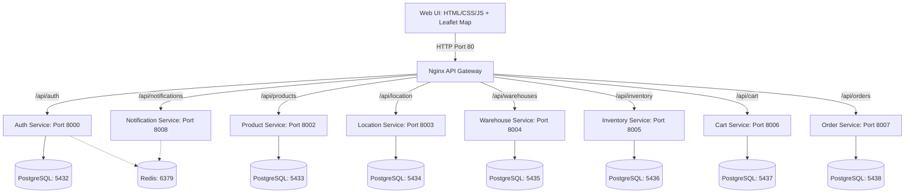

# QuickO Technology Stack & Architecture

This document details the software architecture, programming languages, databases, libraries, port mappings, and API gateway routes for the **QuickO (10-minute grocery delivery)** application.

---

## System Architecture Diagram

---

## 1. Frontend Web Client

The user-facing application is a Single Page Application (SPA) designed to load instantly.

- **Core Technologies**: Vanilla HTML5, CSS3, and JavaScript (ES6+).
- **Interactive Maps**: [Leaflet.js](https://leafletjs.com/) integrated with OpenStreetMap tiles to trace geofence delivery ranges and select customer drop-off pins.
- **Styling Guidelines**: Modular, responsive CSS structure tailored with custom utility tokens (Google Inter typeface integration).

---

## 2. API Gateway (Nginx)

All client traffic passes through an Nginx proxy serving as the single entry point.

- **Port Exposure**: `80` (HTTP)
- **Reverse Proxy Mappings**:

| Inbound Path | Backend Container | Port |
| :--- | :--- | :--- |
| `/api/auth/` | `auth-service` | `8000` |
| `/api/products/` | `product-service` | `8002` |
| `/api/location/` | `location-service` | `8003` |
| `/api/warehouses/` | `warehouse-service` | `8004` |
| `/api/inventory/` | `inventory-service` | `8005` |
| `/api/cart/` | `cart-service` | `8006` |
| `/api/orders/` | `order-service` | `8007` |
| `/api/notifications/` | `notification-service` | `8008` |

---

## 3. Microservices Tech Stack

All services are built as independent containerized microservices utilizing Python.

| Service | Language/Framework | Database | Key Libraries |
| :--- | :--- | :--- | :--- |
| **Auth Service** | Python 3.12 + FastAPI | PostgreSQL (`auth_db` : 5432) | `passlib`, `python-jose`, `redis`, `sqlalchemy` |
| **Product Service** | Python 3.12 + FastAPI | PostgreSQL (`product_db` : 5433) | `alembic`, `sqlalchemy` |
| **Location Service** | Python 3.11 + FastAPI | PostgreSQL (`location_db` : 5434) | `shapely` *(polygon math)*, `geohash2` |
| **Warehouse Service** | Python 3.12 + FastAPI | PostgreSQL (`warehouse_db` : 5435) | `shapely`, `httpx` |
| **Inventory Service** | Python 3.12 + FastAPI | PostgreSQL (`inventory_db` : 5436) | `sqlalchemy`, `httpx` |
| **Cart Service** | Python 3.12 + FastAPI | PostgreSQL (`cart_db` : 5437) | `sqlalchemy`, `httpx` |
| **Order Service** | Python 3.12 + FastAPI | PostgreSQL (`order_db` : 5438) | `sqlalchemy`, `httpx` |
| **Notification Service** | Python 3.12 + FastAPI | None *(Redis + SMTP)* | `fastapi_mail`, `redis` |

---

## 4. Databases & Cache Infrastructure

The project uses Docker-managed state instances configured via `docker-compose.yml`:

- **Relational Storage**: PostgreSQL 16 databases allocated individually per service to prevent database coupling.
- **Caching & OTP Storage**: Redis 7 Alpine cache cluster used by the Auth and Notification services for time-to-live registration payloads.
